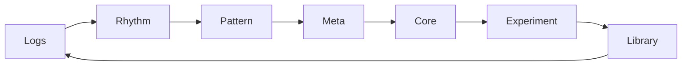

# Second Mind OS Lab

> _R&D Lab for Cognitive Infra and Mental Architecture_

A public R&D interface for builders designing internal developer systems, mental scaffolds, and backend execution models.
This repo is the **modular, forkable layer** of the Second Mind OS Lab — the deep system design lab powering [**@Mindframe Forge**](https://github.com/mindfrm).

## Lab Signature

- **Name**: Second Mind OS — Systems Lab
- **Focus**: Recursive Systems Thinking, Developer Cognitive Infra, Execution Engine Design
- **Methodology**: Loop-first R&D, Feedback Compression, Blueprint-to-Infra Translation
- **Output**: Protocols, Namespaces, Runtime Blueprints, Public Systems

## About the Lab

**Second Mind OS Lab** is a recursive R&D lab focused on building internal developer systems that compress decision overhead and scale backend execution.

We don’t just build tools — we design **systems that think**:  
→ Modular OS architectures  
→ Infra-aware blueprints  
→ Mental model scaffolds  
→ Loop-driven infra protocols

This lab powers **Mindframe Forge**, but runs independently as a system-design-first cognitive engine.

> Code is the last layer. System thinking comes first.

This is the **public interface** of the Second Mind OS Lab.  
→ Internal traces, deep architecture thinking live in Notion:  
→ [smindlab.notion.site](https://smindlab.notion.site/Second-Mind-OS-Lab-1c5af5f3c08f8095a236d220035b5b49)

This repo is the **public-facing interface** — optimized for reuse, scaling, and open knowledge sharing.

---

## Lab OS Map

⚙️ [**`/core`**](./core/README.md) → System blueprints, patterns, and execution mental models.  
🧪 [**`/experiment`**](./experiment/README.md) → Prototypes, system scaffolds, and loopable technical trials.  
📃 [**`/logs`**](./logs/README.md) → Atomic loop entries — system iterations, forks, and reflections.  
📦 [**`/library`**](./library/README.md) → Distilled reference materials — papers, mappings, and citations.  
📰 [**`/rhythm`**](./rhythm/README.md) → Weekly execution trace — blockers, flows, and loop pulses.  
🏛 [**`/meta`**](./meta/README.md) → Lab protocols, decisions, version deltas, and architecture evolution.  
📜 [**`/pattern`**](./pattern/README.md) → Execution DNA — extracted schemas, mental scaffolds, feedback invariants.  
[**`/site`**](./site/README.md) → Public Second Mind OS Lab website.

### Recursive Execution Engine

Second Mind OS Lab evolves through a loop-first execution engine — not by planning ahead, but by compounding small, high-fidelity iterations into scalable systems.

## Purpose

> Build a modular thinking OS for engineers — to think clearly, build systematically, and scale effortlessly.

Build the recursive thinking OS for founders & engineers:
→ To design with clarity  
→ Execute with systems  
→ Scale with leverage

## Lab Belief

> Execution is a function of system clarity.  
> If you can name it, map it, and loop it — you can scale it.

### Thinking Stack

- **System Architecture** → Modular OS, pattern-driven execution
- **Infra Design** → Internal dev platforms, pipelines, latency-aware infra
- **Cognitive Compression** → Decision scaffolds, feedback shaping
- **Runtime Modeling** → Blueprint → Protocol → Infra

---

## License

[**`MIT`**](./LICENSE) — Use, remix, or fork for your own internal labs or system design work.

> **Note**: All forks must include the following in `README.md`:  
> _Powered by [**Second Mind OS Lab**](https://github.com/secondmindlab) — A systems lab for designing execution frameworks, internal platforms, and cognitive scaffolds._

## Contributions

This is an open R&D repo — contributions are welcome if you're:

- Building execution systems for engineering teams
- Designing internal dev platforms
- Exploring cognitive workflows for better software delivery

Open a discussion or reach out:
[secondmindlab@gmail.com](mailto:secondmindlab@gmail.com)

## Related Systems

- [**⚒️ Mindframe Forge**](https://github.com/mindfforge) — Product layer powered by this Lab
- [**🧱 Notion Lab Journal**](https://smindlab.notion.site/Second-Mind-OS-Lab-1c5af5f3c08f8095a236d220035b5b49) — Deep system logs & architecture thinking

Internal developer systems, backend architecture, clarity-by-design.

> _Powered by [**Second Mind OS Lab**](https://github.com/secondmindlab) — A systems lab for designing execution frameworks, internal developer platforms, and cognitive scaffolds._
