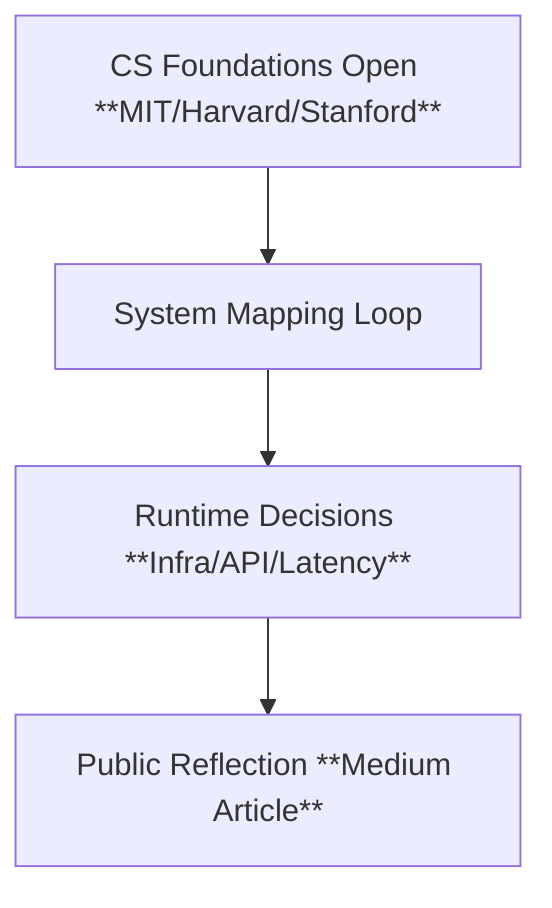

# 📃 Log Entry: Re-Architecting Systems from Open CS Foundations

---
log-id: 2025-04-open-cs-integration  
phase: foundation-re-architecture  
date: 2025-04  
layer: os-lab → personal → execution  
type: systematic-learning → infra-mapping  
status: completed  
linked-output:  
  - type: personal  
    label: Medium Post (published as co-founder)  
    url: https://medium.com/@ltndat/how-i-designed-open-cs-programs-from-harvard-mit-and-stanford-into-my-founder-journey-12043730c428  
---

## Summary

Open CS curriculums (`MIT`, `Harvard`, `Stanford`) offer deep, structured system insights — but often stay abstract.  
This log traces how they were reframed and repurposed directly into runtime product infra decisions.

## System Trace

CS Foundations (Open)  
→ [2025-04-01] System Mapping Loop  
→ [2025-04-04] Runtime Decisions (Infra/API/Latency)  
→ [2025-04-07] Public Reflection (Medium)

## 🔁 Core System Loop

- Iterative system framing across multiple CS paradigms
- Internal loops focused on reconciling latency tradeoffs, infra composition, and modular scalability
- Structured reflection via layered feedback cycles (learning → mapping → infra shaping)

| Loop   | Action                                                   |
| ------ | -------------------------------------------------------- |
| **1.** | Extract primitives (e.g., CS50, MIT OS...)               |
| **2.** | Cross-map to infra design (e.g., ECS, Celery, Lambda)    |
| **3.** | Stress test abstraction against constraints              |
| **4.** | Compare academic vs applied mappings                     |
| **5.** | Publish synthesis (reflection, post-mortem, or protocol) |

## 🚫 Failed Loop Snapshots

| Loop | Failure Reason                                   | Resolution                             |
| ---- | ------------------------------------------------ | -------------------------------------- |
| 2    | Single-queue Celery model bottlenecked under ECS | Added fallback queues + autoscaling    |
| 3    | CS50 tests failed abstraction mapping            | Switched to API contract harness       |
| 4    | Sync latency debug = invalid                     | Switched to async + traffic simulation |

## Time Snapshot

- Total Iteration: 18 hours
- Design Probes: ~27 (across 4 loops)
- Published: 2025-04-12

## ⚒️ Infra Outcomes

This log traces how primitives from MIT OS and Harvard CS50 were translated into [`⚒️ Mindframe Forge`](https://github.com/mindfforge)’s early infra:

| Concept                      | Product Reflection                    |
| ---------------------------- | ------------------------------------- |
| `OS kernels`                 | Latency pattern design in runtime API |
| `CS50 test scaffolds`        | Internal API validation schema        |
| `Queue architecture`         | SQS + async Celery job runners        |
| `Compute/storage separation` | ECS + Terraform config templates      |

## Output Artifacts

- Medium Article ⚓ (Personal Layer): [“How I Designed Open CS Programs from Harvard, MIT, and Stanford Into My Founder Journey”](https://medium.com/@ltndat/how-i-designed-open-cs-programs-from-harvard-mit-and-stanford-into-my-founder-journey-12043730c428)  
  → Layer: ⚓ Personal → 🧱 OS Lab → Article  
  → Published as a co-founder [@ltndat](https://github.com/ltndat)

## Notes & Future Trace Seeds

- This public log is structured for other founders/teams to fork and adapt structured learning into build-ready insight.
- Internal system traces and debugging layers are kept within the private Notion logs.
- Reflections here abstract away internal system tracebacks and architectural pivots.
- Feedback loops (internal & external) were crucial in evolving raw learning into executable infra.
- Full trace available in private Notion log (includes layer-specific iterations, thought stack re-maps, infra deltas).

---

## References

- **📃 Notion Log (private, request-only)**  
  → Title: [“📃 Second Mind OS Log – 2025-04 – Open CS Integration”](https://secondmindlab.notion.site/2025-04_rearchitecting-systems-from-open-cs-md-1d4af5f3c08f80d7b200c0f6116a5813)  
  → Includes full internal debug session, infra diagrams, and cross-layer mapping graphs.

(Note: This artifact emerged from Lab System Loops)

> _This is a Lab log entry — not a tutorial. It reflects one iteration through the OS architecture loop.  
> Logs evolve. So do systems._
