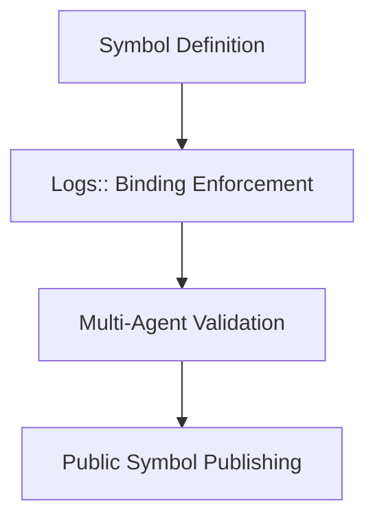

# 📃 Log Entry: Open Verification Layer Integration

---
log-id: 2025-05-ovl-integration  
phase: foundational-verification  
date: 2025-05  
layer: os-lab → symbolic-protocols → execution  
type: mapping → symbol-trace  
status: completed  
linked-output:  
  - type: lab  
    label: Badge Protocol Overview  
    url: https://github.com/secondmindlab/symbol-protocol  
---

### Layer

- 🧱 `Lab Layer` → Defines card schema, symbol structure, and verification logic
- ⚒️ `Execution Layer` → Binds symbol issuance to loop trace logic
- ⚓ `Personal Layer` → Founder-operated logs for cognitive loop reflection

---

## Summary

This log formalizes the integration of Open Verification Layer (OVL) protocols into the symbol logic of Second Mind loop cards.

Each claim on a loop card is now validated via a symbolic signature (`⌬`, `▣`, `◉`) tied to a verifiable system loop.  
Each badge acts as a runtime marker: it exists only if supported by Logs::, confirmed via protocol trace, and reviewed by multi-agent simulation.

> Symbol ≠ style.  
> Symbol = system state.

This ensures that public claims are not narrative, but structural — grounded in reproducible execution.

---

## System Trace



```txt
→ Define symbolic system
→ Bind to closed loops
→ Agent + Meta validation
→ Public-facing symbol integrity
```

---

## 🔁 Core System Loop

| Step   | Action                                          |
| ------ | ----------------------------------------------- |
| **1.** | Define system symbol structure (`⌬`, `▣`, `◉`)  |
| **2.** | Enforce symbol ↔ Logs:: binding before render   |
| **3.** | Stress test via multi-path constraint probes    |
| **4.** | Validate semantic alignment via Meta::Pattern   |
| **5.** | Confirm falsifiability & structure loop closure |

---

## 🚫 Failed Loop Snapshots

| Loop | Failure Reason                            | Resolution                                    |
| ---- | ----------------------------------------- | --------------------------------------------- |
| 2    | Issued `⌬` without personal loop          | Symbol issued before trace closure validation |
| 3    | Premature `◉` issuance without agent pass | Require all-agent validation before publish   |

---

## Time Snapshot

- Total Iteration: \~5.2 hours
- Design Probes: \~8 (across 5 loops)
- Published: 2025-05-07

---

## ⚒️ Infra Outcomes

| Concept           | Reflection / Application                             |
| ----------------- | ---------------------------------------------------- |
| `Symbolic Claims` | Now require loop trace before card render            |
| `Badge Issuance`  | Gated by loop trace + multi-path semantic validation |
| `Loop Closure`    | Treated as precondition, not post-check              |

---

## Output Artifacts

- **Symbolic Card Protocol**
  → Layer: 🧱 Lab
  → Context: Public card ↔ log ↔ system mapping

- **Badge Verification Rule Table**
  → Layer: ⚒️ Execution
  → Context: Enforced via manual Ops; AutoSync pending

---

## Notes & Future Trace Seeds

- Build `AutoBadgeSync` daemon to close symbol issuance loop
- Extend badge logic into infra events & GitHub PR traceability
- Explore zero-knowledge or hash-based symbol verification

---

### References

- **📃 Notion Log (private, request-only)**  
  → Title: ["📃 Second Mind OS – 2025-05 – Open Verification Layer Integration"](https://secondmindlab.notion.site/Logs-2025-05-OvlIntegration-1ecaf5f3c08f8064a75bf489990f69cf)
  → Contains: agent scaffolds, failed loop traces, cognitive UX metrics

> _This log captures 1 full loop of system evolution inside Second Mind OS Lab.
> Public symbols are now backed by structural logic, not belief or narrative._
