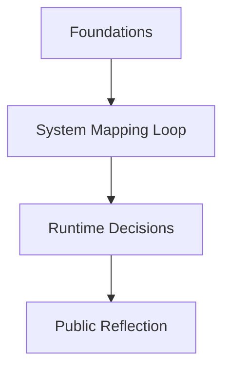

# Log Entry: [TITLE HERE]

---
log-id: [yyyy-mm-title-kebab]  
phase: [phase-name]  
date: [yyyy-mm]  
layer: os-lab → [optional-sub-layer] → [execution/personal/studio]  
type: [learning/mapping/building] → [focus-area]  
status: [draft/in-progress/completed]  
linked-output:  
  - type: [personal/studio/internal]  
    label: [Output Label Here]  
    url: https://example.com  
<!-- - type: studio (optional) -->  
<!-- label: Planned integration -->  
<!-- path: /infra/second-mind-thought-runtime -->  
---

## 📍 Context

Brief intro (2-5 lines) on why this loop/log happened.  
Should set the stage: what was abstract, what was missing, what triggered the dive?

## 🧱 System Trace

Mermaid diagram
Example:



```txt
[High-level trace of flow]
Example:
Input (CS/Infra/Reflection)
→ Feedback Loop
→ Runtime Infra Shaping
→ External Output (Post/Product/Decision)
```

## 🔧 Core System Loop

- What were the core thought loops / learning cycles?
- How did they compound? Across what frameworks / references?
- What was reframed, restructured, or internalized differently?

## 🛠️ Infra / Conceptual Outcomes

If relevant, include tangible reflections or mappings:  
| Concept / Insight | Reflection / Application |
|-----------------------------|----------------------------------------|
| `Concept 1` | How it reflected in system/product |
| `Pattern` | What was done with it? Why? |

## 📤 Output

List clearly where this trace loop surfaced into tangible output (if any):

- [Output Title](https://example.com)  
  ↳ Layer: [Personal/Studio]  
  ↳ Context: [Blog post, internal diagram, shipped infra, etc.]

## 🧭 Notes & Future Trace Seeds

- What might be forked or abstracted for future loops?
- What was left unresolved / open-ended for next iterations?
- Any intentional design tensions that were left active?

---

## 🔗 Internal Reference

- **📓 Notion Log (private, request-only)**  
  ↳ Title: ["Second Mind OS – YYYY-MM – [Log Name]"](https://link-to-notion-if-used.com)  
  ↳ Contains: raw debug traces, deeper architectural diagrams, thought stack pivots.

> _This is a Lab log entry — not a tutorial.  
> It reflects one internal pass through the Second Mind OS loop.  
> Logs evolve. So do systems._
