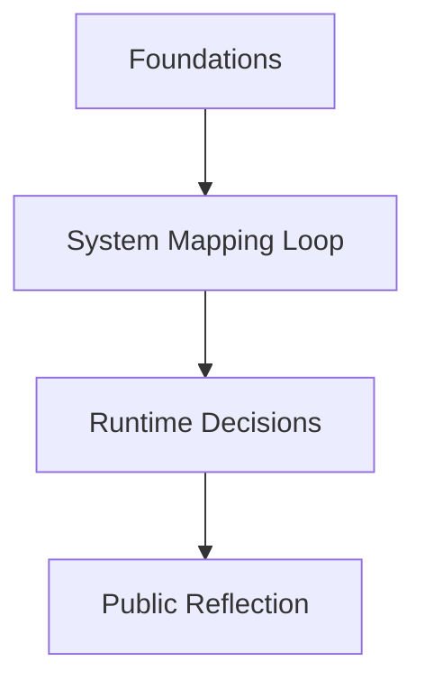

# 📃 Log Entry: [TITLE HERE]

---
log-id: [yyyy-mm-title-kebab]  
phase: [phase-name]  
date: [yyyy-mm]  
layer: os-lab → [optional-sub-layer] → [execution/personal/execution]  
type: [learning/mapping/building] → [focus-area]  
status: [draft/in-progress/completed]  
linked-output:  
  - type: [personal/execution/lab]  
    label: [Output Label]  
    url: https://example.com  
<!-- - type: execution (optional) -->  
<!-- label: Planned integration -->  
<!-- path: /infra/second-mind-thought-runtime -->  
---

### Layer

- 🧱 `Lab Layer` → System design, cognition modeling
- ⚒️ `Execution Layer` → Infra mapping (Forge, DevOps)
- ⚓ `Personal Layer` → Narrative artifact (blog)

## Core Structure (Required)

### Summary

Concise narrative of how thought evolved into infra or artifact.
Should trace 1 system loop: input → mental shift → infra delta/output.

### System Trace

Mermaid diagram
Example:



```txt
[High-level trace of flow]
Example:
Input (CS/Infra/Reflection)
→ Feedback Loop
→ Runtime Infra Shaping
→ External Output (Post/Product/Decision)
```

### 🔁 Core System Loop

Example:

| Step   | Action                                                   |
| ------ | -------------------------------------------------------- |
| **1.** | Extract primitives (e.g., CS50, MIT OS...)               |
| **2.** | Cross-map to infra design (e.g., ECS, Celery, Lambda)    |
| **3.** | Stress test abstraction against constraints              |
| **4.** | Compare academic vs applied mappings                     |
| **5.** | Publish synthesis (reflection, post-mortem, or protocol) |

### Mapping

| Course | Concept            | Infra Realization          |
| ------ | ------------------ | -------------------------- |
| MIT OS | Schedulers, memory | Async job runners (Celery) |

## 🚫 Failed Loop Snapshots

Example:

| Loop | Failure Reason                                   | Resolution                             |
| ---- | ------------------------------------------------ | -------------------------------------- |
| 2    | Single-queue Celery model bottlenecked under ECS | Added fallback queues + autoscaling    |
| 3    | CS50 tests failed abstraction mapping            | Switched to API contract harness       |
| 4    | Sync latency debug = invalid                     | Switched to async + traffic simulation |

## Time Snapshot

- Total Iteration: x hours
- Design Probes: ~x (across y loops)
- Published: YYYY-MM-DD

## ⚒️ Infra Outcomes

If relevant, include tangible reflections or mappings:  
| Concept / Insight | Reflection / Application |
|-----------------------------|----------------------------------------|
| `Concept 1` | How it reflected in system/product |
| `Pattern` | What was done with it? Why? |

## Output Artifacts

List clearly where this trace loop surfaced into tangible output (if any):

- [Output Title](https://example.com)  
  → Layer: [⚓ Personal / ⚒️ Execution / 🧱 Lab]  
  → Context: [Blog post, internal diagram, shipped infra, etc.]

### Notes & Future Trace Seeds

- What might be forked or abstracted for future loops?
- What was left unresolved / open-ended for next iterations?
- Any intentional design tensions that were left active?

---

### References

- **📃 Notion Log (private, request-only)**  
  → Title: "📃 Second Mind OS – YYYY-MM – [Log Name]"
  → Contains: raw debug traces, deeper architectural diagrams, thought stack pivots.

> _This is a Lab log entry — not a tutorial.  
> It reflects one internal pass through the Second Mind OS loop.  
> Logs evolve. So do systems._
